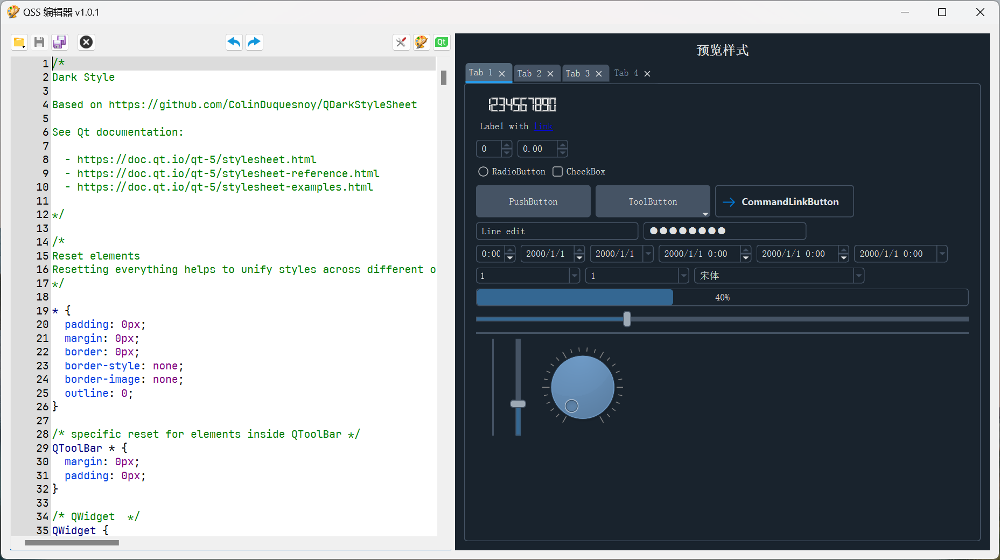

<h1 align="center">QSS Editor</h1>
<h3 align="center">A cross-platform tool to edit and preview Qt style sheets.</h3>

## Building

1. Clone `https://github.com/winsoft666/qsseditor`
2. Open `QssEditor-All.pro` in Qt Creator
3. Build `QssEditor-All` with a preferred or the default kit
